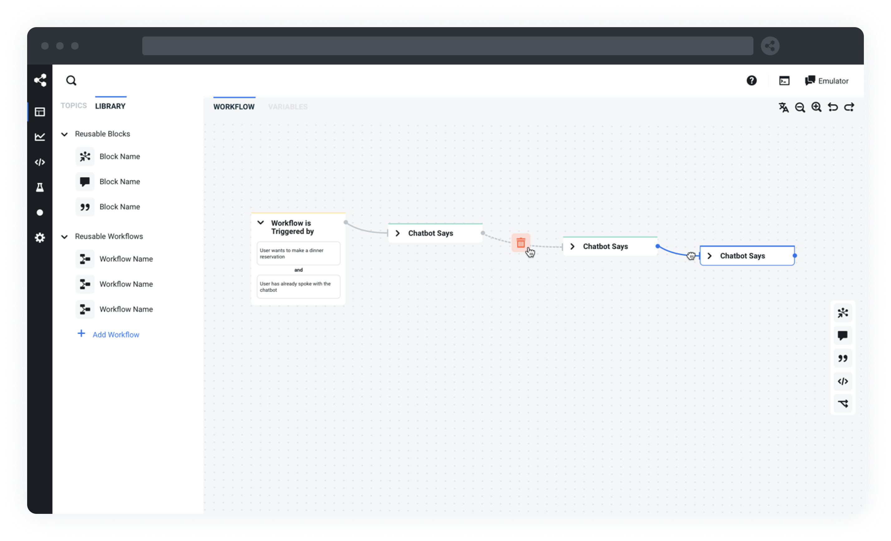

# [Mlchain](https://mlchain.com/?utm_source=github&utm_medium=organic&utm_campaign=mlchain_repo&utm_term=readme) — The building blocks for building chatbots

**IMPORTANT**: With the launch of Mlchain Cloud, the documentation for Mlchain v12 can now be found [here](https://v12.mlchain.com/).

## What is Mlchain?

Mlchain is the standard developer stack to build, run, and improve conversational AI applications. Powered by natural language understanding, a messaging API, and a fully featured studio, Mlchain allows developers and conversation designers around the globe to build remarkable chatbots without compromise.

The fastest & easiest way to get started with Mlchain is by signing up for free to **[Mlchain Cloud](https://sso.mlchain.cloud/registration)**. Alternatively, continue reading for more information about Mlchain v12.

**Out of the box, Mlchain v12 includes:**

- Administration panel to orchestrate and monitor your chatbots
- Conversation Studio to design a conversation, manage content, code custom integration
- Easy integration with messaging channels (Messenger, WhatsApp, Slack, Teams, Webchat, Telegram, SMS & more)
- Natural Language Understanding
- Complete list of features and specs [here](https://v12.mlchain.com/overview/features)

## Getting Started

There are a few ways to get started with Mlchain v12:

- Download the latest binary for your OS [here](https://v12.mlchain.com/) and follow the [installation docs](https://v12.mlchain.com/overview/quickstart/installation).
- Use the official [Docker image](https://hub.docker.com/r/mlchain/server) and follow the [hosting docs](https://v12.mlchain.com/going-to-production/deploy/docker-compose)
- Run from sources, follow [build docs](https://v12.mlchain.com/going-to-production/deploy/)
- Deploy it in the cloud using these shortlinks:

  

      

        &nbsp;
       &nbsp;
  

## Documentation

- [Main Documentation](https://v12.mlchain.com/)
- [SDK Reference](https://mlchain.com/reference/)
- [Code Examples](https://github.com/mlchain/oss/tree/master/examples)
- [Video Tutorials](https://www.youtube.com/c/mlchain)

## Community

- [Discord](https://discord.gg/mlchain) - Get community support and find answers to your questions
- [Issues](https://github.com/mlchain/oss/issues) - Report bugs and file feature requests
- [Blog](https://mlchain.com/blog) - How to's, case studies, and announcements
- [Contributing](/.github/CONTRIBUTING.md) - Start contributing to Mlchain
- [Partners](/.github/PARTNERS.md) - List of agencies who can help you with Mlchain

## License

Mlchain is dual-licensed under [AGPLv3](/licenses/LICENSE_AGPL3) and the [Mlchain Proprietary License](/licenses/LICENSE_MLCHAIN).

By default, any bot created with Mlchain is licensed under AGPLv3, but you may change to the Mlchain License from within your bot's web interface in a few clicks.

For more information about how the dual-license works and why it works that way, please see the <a href="https://mlchain.com/faq">FAQS</a>.

